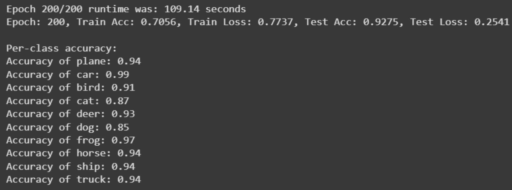
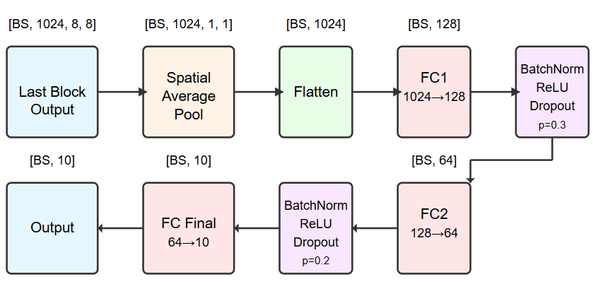
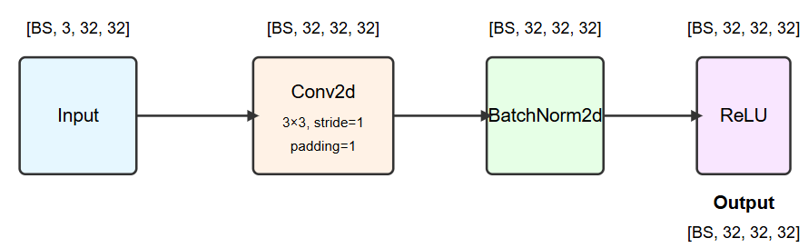
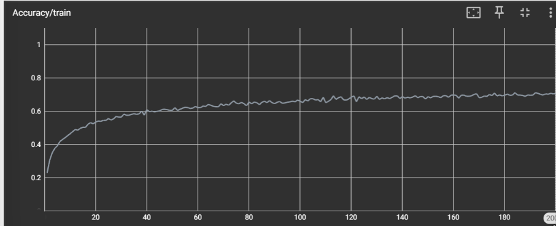
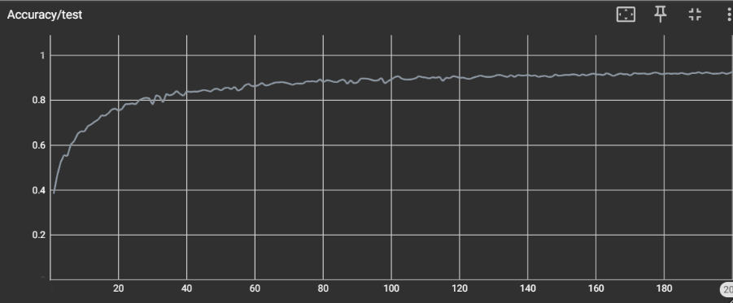
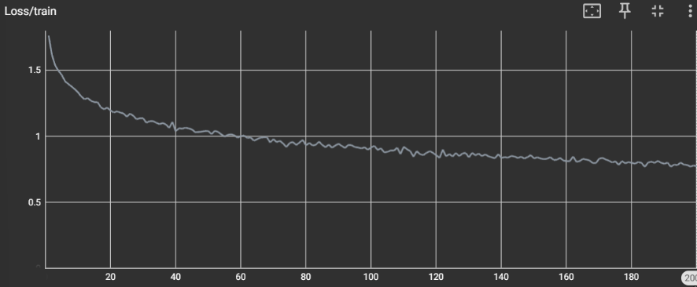
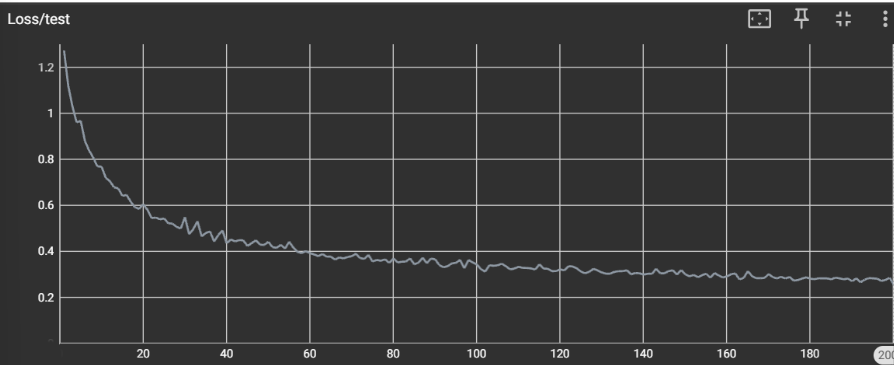

# Custom CNN for CIFAR-10 Classification
A PyTorch implementation of a custom CNN architecture achieving **92.75% accuracy** on the CIFAR-10 dataset.

## Architecture

**KitNet Model:**
- Stem: 3→32 channels initial feature extraction
- 6 Dynamic Blocks with attention-weighted multi-kernel convolutions
- Classifier: Multi-layer FC network with dropout
- Progressive channels: [32, 64, 128, 256, 512, 768, 1024]

**Key Features:**
- 4 parallel convolutions per block with learned attention weights
- Bottleneck layers for channel reduction
- Skip connections for residual learning
- Batch normalisation and ReLU activations

## Training Progress

*Training accuracy progression over 200 epochs*

*Validation accuracy progression over 200 epochs*

*Training loss curve showing convergence*

*Validation loss curve showing stable training*

## Training Methods

**Data Augmentation:**
- MixUp (α=0.2): Linear interpolation between samples
- CutMix (α=1.0): Spatial patch mixing
- Random crop, horizontal flip (p=0.3), colour jitter (0.15), rotation (±10°)

**Loss Function:**
- Focal Loss (γ=2.0) with label smoothing (0.1)
- Class reweighting: cats (1.2x), birds/dogs (1.1x), deer (1.05x)

**Optimisation:**
- SGD with Nesterov momentum (0.9)
- OneCycleLR scheduler: max_lr=0.05, warmup 15%, final_lr=0.000005
- Weight decay: 0.0005
- Dropout: 0.3 (hidden), 0.2 (final layer)

## Configuration
| Parameter | Value | Parameter | Value |
|-----------|-------|-----------|-------|
| Epochs | 200 | Batch Size | 128 |
| Learning Rate | 0.01 | Weight Decay | 0.0005 |
| Momentum | 0.9 | Dropout | 0.3 |
| Num Blocks | 6 | Kernels per Block | 4 |
| MixUp Alpha | 0.2 | CutMix Alpha | 1.0 |

## Results
**Final Test Accuracy: 92.75%**

The high accuracy was achieved through:
1. Dynamic convolutions with attention weighting for adaptive feature extraction
2. Hybrid data augmentation (MixUp + CutMix) for better generalisation
3. Focal loss with class reweighting to handle difficult classes
4. OneCycle learning rate scheduling for optimised convergence
5. Proper regularisation (dropout, weight decay, early stopping)

## Files
- `Coursework_final.ipynb` - Complete training pipeline
- `checkpoints/` - Model checkpoints
- `runs/` - TensorBoard logs

## References
- He, K. et al. (2016). Deep Residual Learning for Image Recognition. CVPR.
- Lin, T.-Y. et al. (2017). Focal Loss for Dense Object Detection. ICCV.
